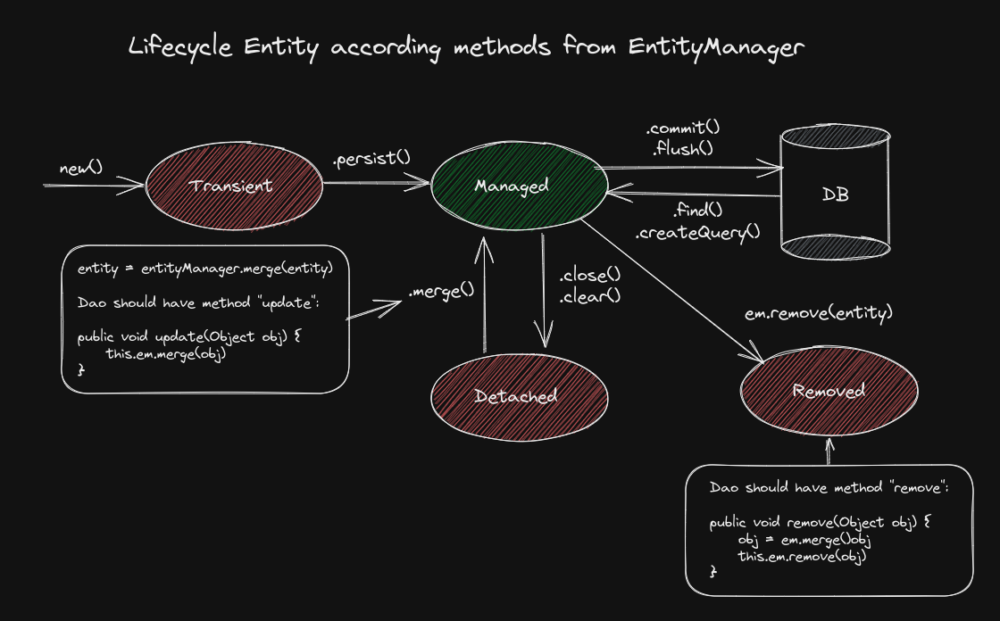

# JPA Training

Repository created during JPA training at Alura course. 
The firsts steps was focused in what dependencies in Maven should be
used and how to set the persistence.xml file with JPA and Hibernate properties.

# Resources

- Maven;
- Hibernate;
- MySQL

## Learning

- The advantages to use JPA specification instead pure JDBC to access databases;
- The history of Hibernate creation and JPA;
- How to create an Maven application and add Hibernate as dependency of it;
- How to set JPA with persistence.xml file;
- How to mapping JPA Entities;
- How to use EntityManager to persist Entities into databases;
- How to develop an DAO class using JPA;
- How to map attributes of Enum Type into an Entity (Ex.: @EnumeratedValue(EnumType.STRING));
- How to map relationship between Entities;
- How works Entity lifecycle:
  
- How to create queries with JPQL using methods as .find() and .createQuery();
- How to create queries with filters;
- How to create queries where return is specific attributes from entities;
- How to map a Many-to-Many relationship;
- How to persist entities that has bidirectional relationship;
- How to create queries using aggregation functions as MIN(), MAX(), AVG() and SUM();
- How to write queries using JPQL;
- How to use the feature "SELECT new" from JPA;
- How to use named queries (@NamedQuery annotation);
- How to use EAGER and LAZY strategies in entities that have relationship;
- How to handle with LazyInitializationException using queries planned with the "JOIN FETCH" feature;
- How to apply good practices in entities with relationships;
- How to create queries with optional parameters using the CriteriaAPI from JPA;
-

## 🔗 Links

